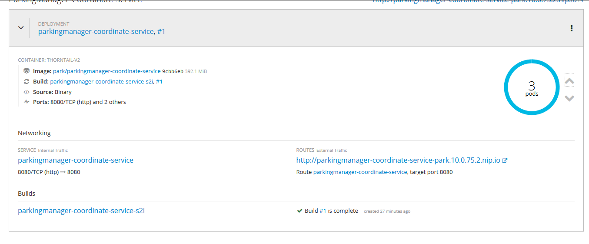
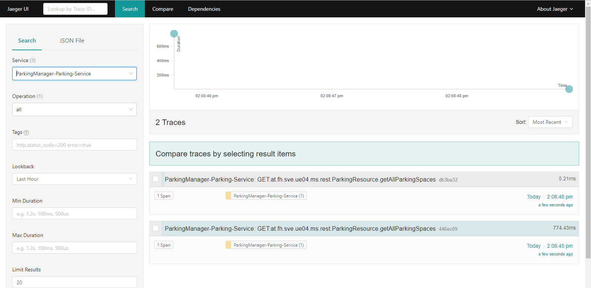

# Dokumentation - CLC - Projekt
##### Christoph Ruhsam, Gattringer Marko

### Kurzbeschreibung
Im Zuge meiner Masterarbeit (Marko Gattringer) wird unter anderem ein Algorithmus entwickelt, welcher einen gezeigten Workflow automatisch aus einem Screencastvideo extrahieren kann. Da dieser Algorithmus sehr rechenintensiv ist (Neuronales Netz mit Tensorflow-GPU) und das Setup dazu nicht trivial ist (Linux, CUDA, Tensorflow-GPU, Python, …), soll dieser als Service angeboten werden. Dazu soll das Service als Microservice angeboten werden und in Openshift (https://www.openshift.com/) gehostet werden. Weiters dient ein kleine Webapp als Frontend (Login, Verwalten seiner Videos, …). An diesem Beispiel soll gezeigt werden, wie so eine Applikation in Openshift betrieben werden kann. Dabei werden auch Konzepte wie zBsp.: „Infrastructure-as-Code“ oder „Continuous deployment“ umgesetzt.

### Ziel / erwartetes Ergebnis
Microservice-Architektur, welche Lokal (zu Test- und Entwicklungszwecken) als auch in Openshift lauffähig ist.
Angular 8 Frontend, das auch in OpenShift läuft.
Es soll einfach möglich sein, einen Serviceaufruf (auch über mehrere Services hinweg) zu tracen (Jaeger).
Die Build-, Test- und Deploymentvorgänge werden mithilfe von Openshift-Pipelines und Jenkins automatisiert.

### Projektstruktur
* **SCAAnalyzerService** (Pyhton): 

* **SCAPersistService** (Quarkus):

* **SCAAngularFrontend** (Angular 8):

### Architektur
In OpenShift sieht die Architektur wie folgt aus:
 

##### Verwendete Technologien/Bibliotheken
* **https://microprofile.io/:** Eine Initiative um Java EE für Microsservice-Architekturen zu optimieren. Unterschiedliche Metriken, wie Health, Count, Timed, ...
* **https://www.jaegertracing.io/:** Ein Framework zum Monitoren von Microservices.
* **https://www.openshift.com/:** Ist eine Container-Plattform von Redhat, welche auf Docker und Kubernetes aufbaut.
* **https://jenkins.io/** Automation Server für automatisierte Build-, Test- und Deploymentvorgänge.

### Setup
TODO Codeready Container
2) In gewünschtes Verzeichnis entpacken und PATH Variable um dieses Verzeichnis erweitern
3) Docker starten (muss laufen damit Openshift Cluster gestartet werden kann, basiert auf Docker-Images)
4) <code>oc cluster up</code>: startet einen neuen Cluster
5) <code>oc login</code>: am lokalen Cluster anmelden (fabric8 deployed in den Cluster an dem man aktuell eingeloggt ist) -> USER/PASSWORT kann beliebig gewählt werden , 
6) <code>oc new-project [PROJEKTNAME]</code>: Legt ein neues Projekt an
7) <code>oc process -f https://raw.githubusercontent.com/jaegertracing/jaeger-openshift/master/all-in-one/jaeger-all-in-one-template.yml | oc create -f -</code>: Deployt ein vorgefertigtes Jaeger Template
8) <code>oc process -f https://raw.githubusercontent.com/sabre1041/openshift-api-swagger/master/openshift-api-swagger-template.yml | oc apply -f-</code>: Deployt ein vorgefertigtes SwaggerUI Template
9) <code>mvn fabric8:deploy -Pfabric8</code>: Muss in dem Root-Verzeichnis des jeweiligen Services ausgeführt werden. Deployt das Service in OpenShift.

### OpenShift
OpenShift ist eine OpenSource Container Application Platform und setzt auf Kubernetes auf.
Nach dem Befehl <code>oc cluster up</code> kann unter **localhost:8443** die grafische Oberfläche aufgerufen werden.
Sind bereits Services in OpenShift deployt, sieht dies wie folgt aus:
  

Ein Service kann auf hinauf-/heruntergescaled werden. Dadurch können mehrere Pods gestartet werden. Das Load-Balancing wird von OpenShift übernommen.

### OpenTracing mit Jaeger
Jaeger ist ein Tracing System, das OpenSource zur Verfügung steht. Es wird für Monitoring und Troubleshooting bei Microservice-Architekturen verwendet.
Um Jaeger mit Thorntail und JavaEE verwenden zu können, werden folgende Teile benötigt:
- **io.quarkus.quarkus-smallrye-opentracing** Dependency
- Im *application.properties* folgende Konfigurationsparameter:
    - service-name: Service Name der mit den Spans assoziiert wird
    - agent-host: Host unter dem der jaeger-agent erreichbar ist
        - Dieser ist für die lokale Entwicklung localhost
        - Und in OpenShift **NICHT** die Route von Jaeger, sondern der Container Name von Jaeger. In unserem Fall "jaeger-agent".
    - agent-port: Port unter dem der jaeger-agent erreichbar ist.
    - reporter-flush-interval: Definiert, wie oft Jaeger die Spans flusht
    - sampler-type: Definiert den Typ des Samplers, z.B.: probabilistic oder const
    - sampler-parameter: Configurations-Wert für den Sampler, z.B.: probabilistic = 0.001
    
Ist Jaeger und ein Service deployed und eine getracte REST-Resource dieses Service wird aufgerufen, wird der Span an Jaeger gesendet. Mittels der JaegerUI, deren URL in OpenShift zu sehen ist, können die Traces angesehen werden.

### MongoDB
Deployen und Starten der MongoDB in OpenShift:
    - oc new-app -e MONGODB_USER=test -e MONGODB_PASSWORD=test -e MONGODB_DATABASE=sca -e MONGODB_ADMIN_PASSWORD=test openshift/mongodb-24-centos7
Exposen der Route:
    - oc expose svc/mongodb-24-centos7